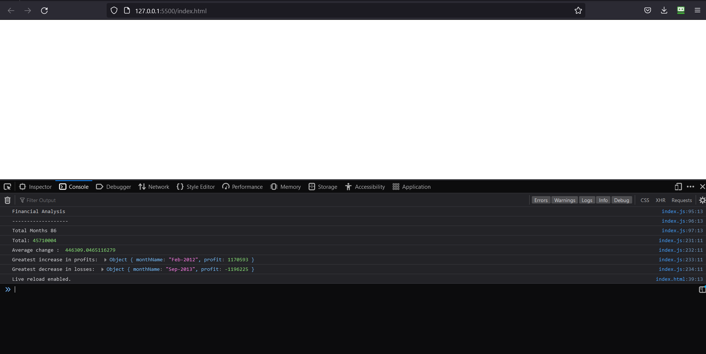

# Console-Finaces

## Description 

Financial Analysis JavaScript code that analyzes the records to calculate the total number of months included in the dataset, the net total amount of Profit/Losses over the entire period, the average of the changes in Profit/Losses over the entire period, as well as the greatest increase in profits and decrease in losses for the entire period.

## Installation

N/A

## Usage

The code can be used to analyze a dataset for a given period and oput put data such as profit and loss for that give period. to view the results open the web browser and open the console where the results will be ouput.

Can be viewed here:

https://uklivewire.github.io/Console-Finaces/

## Licence

Licenced under the MIT licence.